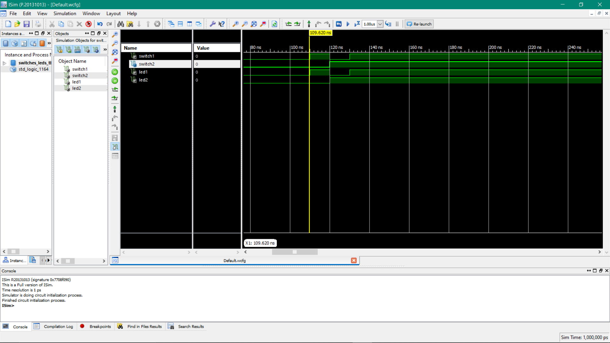

# VHDL Projects Basics 

# Software:  ✔ XILINX (ISE Design Suite 14.7v)

P1-Switches and Leds: Two Leds can be controlled by two switches respectively. I have also wrote a code in testBench to simulate that program.

